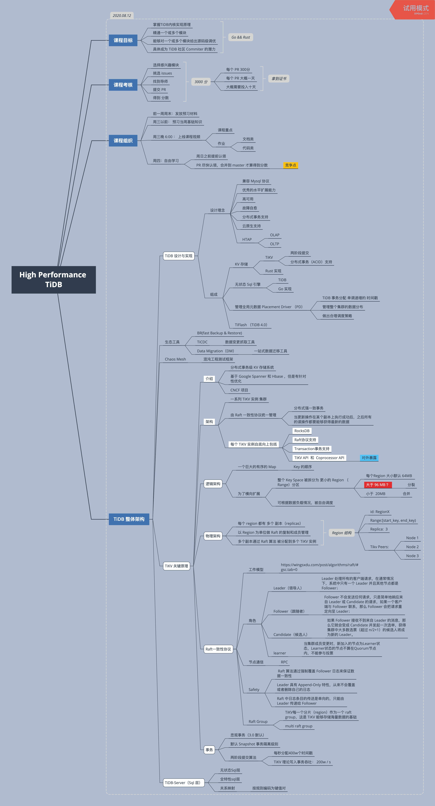
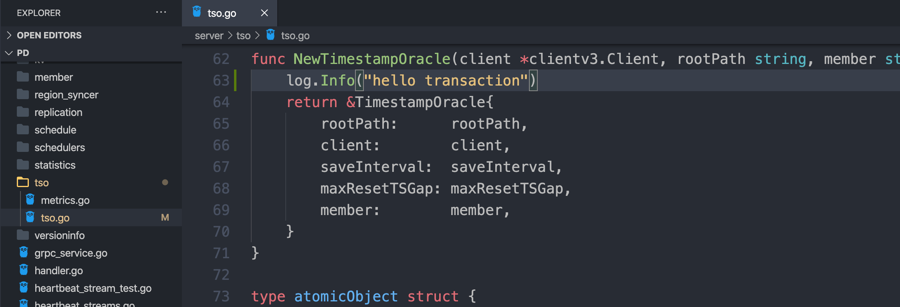
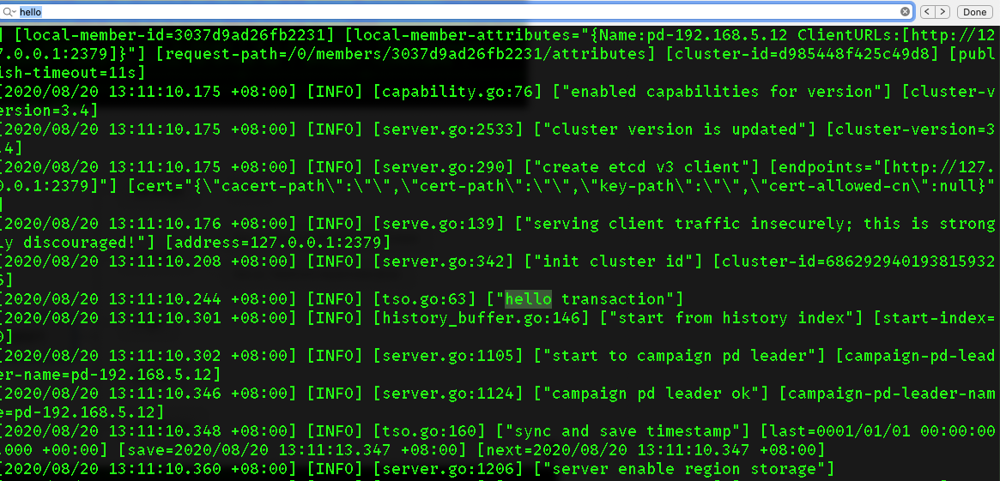

# 第一节课： TiDB 整体架构



参考资料：

- [How do we build TiDB](https://pingcap.com/blog-cn/how-do-we-build-tidb/)
- [三篇文章了解 TiDB 技术内幕 - 说存储](https://pingcap.com/blog-cn/tidb-internal-1/)
- [三篇文章了解 TiDB 技术内幕 - 说计算](https://pingcap.com/blog-cn/tidb-internal-2/)
- [三篇文章了解 TiDB 技术内幕 - 谈调度](https://pingcap.com/blog-cn/tidb-internal-3/)

# 作业简介

本地下载TiDB，TiKV，PD源码，改写源码并编译部署以下环境：

- 1 TiDB
- 1 PD
- 3 TiKV 

改写后：使得TiDB 启动事务时，打印出一个 “hello transaction”的日志。

# 作业分析

本次作业的目的，应该是让大家了解 TiDB 的整体架构，以及了解整个 TiDB 的事务流程。

所以，在事务启动整个过程中涉及的任意代码处增加日志打印，就可以输出 “hello transaction”。

# 改写思路

单看课程预习的资料，好像有点不够。还需要进一步了解 TiDB 的事务模型。参考这篇文章：[TiDB 新特性漫谈：悲观事务](https://pingcap.com/blog-cn/pessimistic-transaction-the-new-features-of-tidb/)。

注：TiDB 3.0 引入悲观锁，4.0 已经开始默认使用悲观事务模型了。

### TiDB 的事务模型重点摘录：

TiDB 的事务模型是基于 Google 在 OSDI 2010 的一篇 论文 中提出的在一个分布式 KV 系统上构建分布式事务的模型 Percolator 。其本质上还是一个标准的 2PC（二阶段提交），2PC 是一个经典的分布式事务的算法。

TiDB 中 Percolator 的写事务流程：

1. 每当事务开始时，协调者（在 TiDB 内部的 tikv-client 充当这个角色）会从 PD leader 上获取一个 timestamp，然后使用这个 ts 作为标记这个事务的唯一 ID。 而在 PD leader 上负责分配单调递增 timestamp 的就是 TSO（Timestamp Oracle）。
2. 标准的 Percolator 模型采用的是乐观事务模型，在提交之前，会收集所有参与修改的行（key-value pairs），从里面随机选一行，作为这个事务的 Primary row，剩下的行自动作为 secondary rows，这里注意，primary 是随机的，具体是哪行完全不重要，primary 的唯一意义就是负责标记这个事务的完成状态。
3. 在选出 Primary row 后， 开始走正常的两阶段提交，第一阶段是上锁+写入新的版本，所谓的上锁，其实就是写一个 lock key。
4. 在 2PC 的第二阶段，标志事务是否提交成功的关键就是对 Primary lock 的处理，如果提交 Primary row 完成（写入新版本的提交记录+清除 Primary lock），那么表示这个事务完成，反之就是失败，对于 Secondary rows 的清理不需要关心，可以异步做。

理解了 Percolator 的模型后，大家就知道实际上，Percolator 是采用了一种化整为零的思路，将集中化的事务状态信息分散在每一行的数据中（每个事务的 Primary row 里），对于未决的情况，只需要通过 lock 的信息，顺藤摸瓜找到 Primary row 上就能确定这个事务的状态。

为什么要使用悲观锁?

TiDB 的悲观锁实现的原理确实如此，在一个事务执行 DML (UPDATE/DELETE) 的过程中，TiDB 不仅会将需要修改的行在本地缓存，同时还会对这些行直接上悲观锁，这里的悲观锁的格式和乐观事务中的锁几乎一致，但是锁的内容是空的，只是一个占位符，待到 Commit 的时候，直接将这些悲观锁改写成标准的 Percolator 模型的锁，后续流程和原来保持一致即可，唯一的改动是:对于读请求，遇到这类悲观锁的时候，不用像乐观事务那样等待解锁，可以直接返回最新的数据即可。

### 作业思路

既然，每当事务开始时，协调者会从 PD leader 上获取一个 timestamp，那么我直接在这个TSO相关代码中打一行 Log 就可以了。

打开 PD 项目，找到 `server/tso/tso.go`，在第 62行 `NewTimestampOracle` 函数中加入 Log 打印：



理论上，还有其他位置可以插入，只要在事务流程中即可。

无论如何，先编译环境验证思路吧！

（可谁能想到，写代码5分钟，编译花了五天 。。。）


# 编译环境

编译 TiDB 参考了李逸龙同学的 [Dockerfile](https://github.com/dragonly/hp-tidb-course/blob/master/week1/run/Dockerfile)。

经历的坑：

1.使用 李逸龙 同学的[Dockerfile](https://github.com/dragonly/hp-tidb-course/blob/master/week1/run/Dockerfile)发现，清华源的Rustup不支持 Nightly Rust 2020-7-1 （也许是从源里删掉了）。换成 2020-7-10，又发现tikv的protobuf依赖库报错。
2. 换回中科大源，网络不稳定，陆陆续续编译了三天，终于装好了nightly 2020-7-1。
3. Tikv 跑起来，发现硬盘又不够用了 。。。才发现是 Debug 模式编译，然后使用release 模式编译，TiKV 编译文件才缩减，硬盘凑合够用」。
4. 之前未修改GOPROXY 为国内源，换了两个梯子都不行，还以为梯子坏了。

建议： 

还是搞一个香港服务器比较好。学习群有小伙伴推荐：阿里云香港服务器，4核4G，按量付费， 1.2 元/小时，做完作业就停掉，一共花 2元钱。

### 启动服务

参考官方：

```
# start pd, 1 instance
./pd-server \
  --name=pd1 \
  --data-dir=pd1 \
  --client-urls="http://127.0.0.1:2379" \
  --peer-urls="http://127.0.0.1:2380" \
  --initial-cluster="pd1=http://127.0.0.1:2380" \
  --log-file=pd1.log &
# start tikv, 3 instances
./tikv-server \
  --pd-endpoints="127.0.0.1:2379" \
  --addr="127.0.0.1:20160" \
  --data-dir=tikv1 \
  --log-file=tikv1.log &
./tikv-server \
  --pd-endpoints="127.0.0.1:2379" \
  --addr="127.0.0.1:20161" \
  --data-dir=tikv2 \
  --log-file=tikv2.log &
./tikv-server \
  --pd-endpoints="127.0.0.1:2379" \
  --addr="127.0.0.1:20162" \
  --data-dir=tikv3 \
  --log-file=tikv3.log &

./tidb-server \
  --store=tikv \
  --path="127.0.0.1:2379" \
  --log-file=tidb1.log &
```

注： 启动TiKV的时候需要修改OS支持的最大文件数

> sudo launchctl limit maxfiles 100000 500000
> ulimit -S -n 82920

TiKV 目前要求最大文件数为 82920

接下来使用 mysql 客户端进行测试：

TiDB 默认端口为 4000:

```
$ mysql -h 127.0.0.1 -P 4000 -u root -D test
...
mysql> use INFORMATION_SCHEMA;
mysql> select * from CLUSTER_INFO;

```

因为这里修改的是 PD，所以看 PD 的日志，能看到输出：



至此，作业完成！

### 后续


后续查看其他两位同学的作业，还有其他思路：

1. 修改 TiDB : `server/conn.go` 。 参考：[wangcy6](https://github.com/wangcy6/leetcode/blob/master/study/TiDB/weeky1.md)
2. 修改 TiDB : `store/tikv/txn`。 参考 [高性能TiDB课程系列 - week 1](https://elon.fun/posts/hptidb-hello-transaction)

第二篇资料里提到的PingCAP博客中给出的分布式事务流程表，也值得参考：


理论上，修改 TiKV 源码应该也是可以的，但因为 TiKV 编译比较耗时，就不尝试了。这里只说个思路：

> 既然，二阶段处理事务主要是对`Primary lock` 进行处理，那在相关代码中插入一行 Log 肯定也可以打印日志。
> 比如 `tikv/src/storage/txn/commands/check_txn_status.rs`

